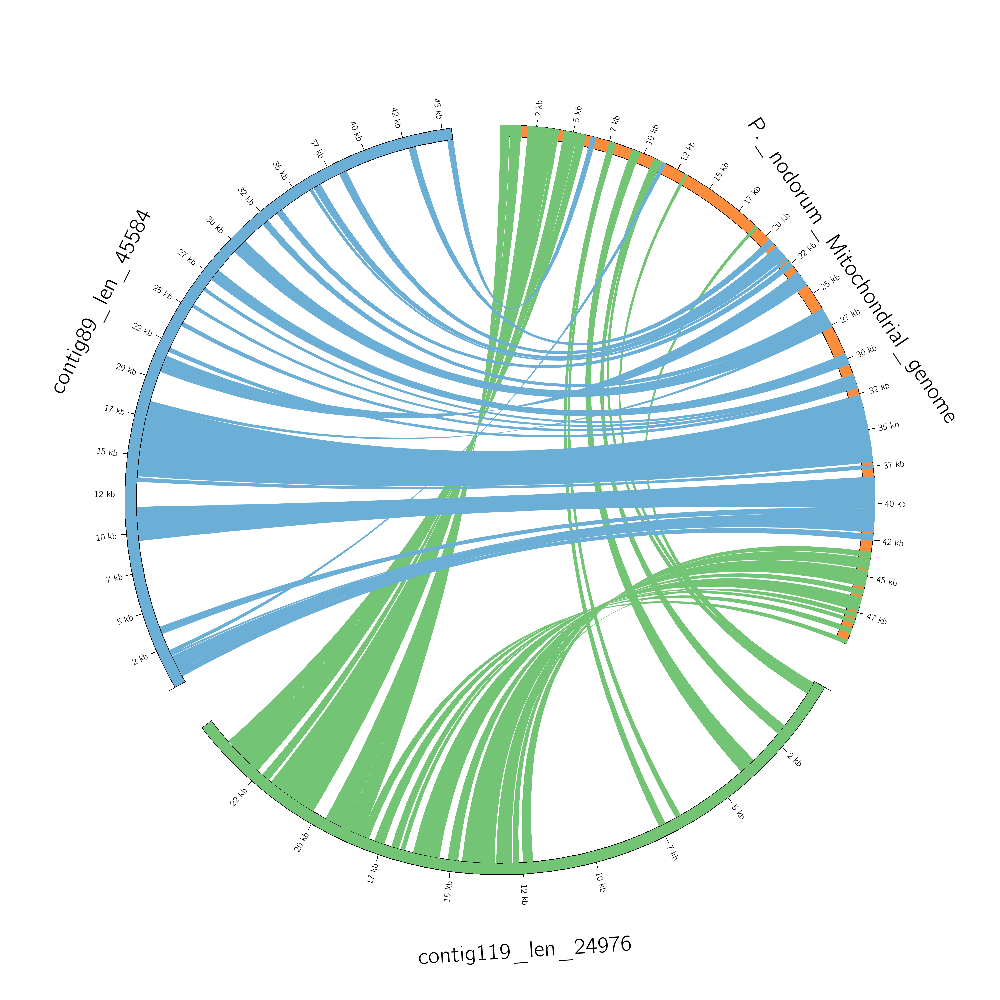
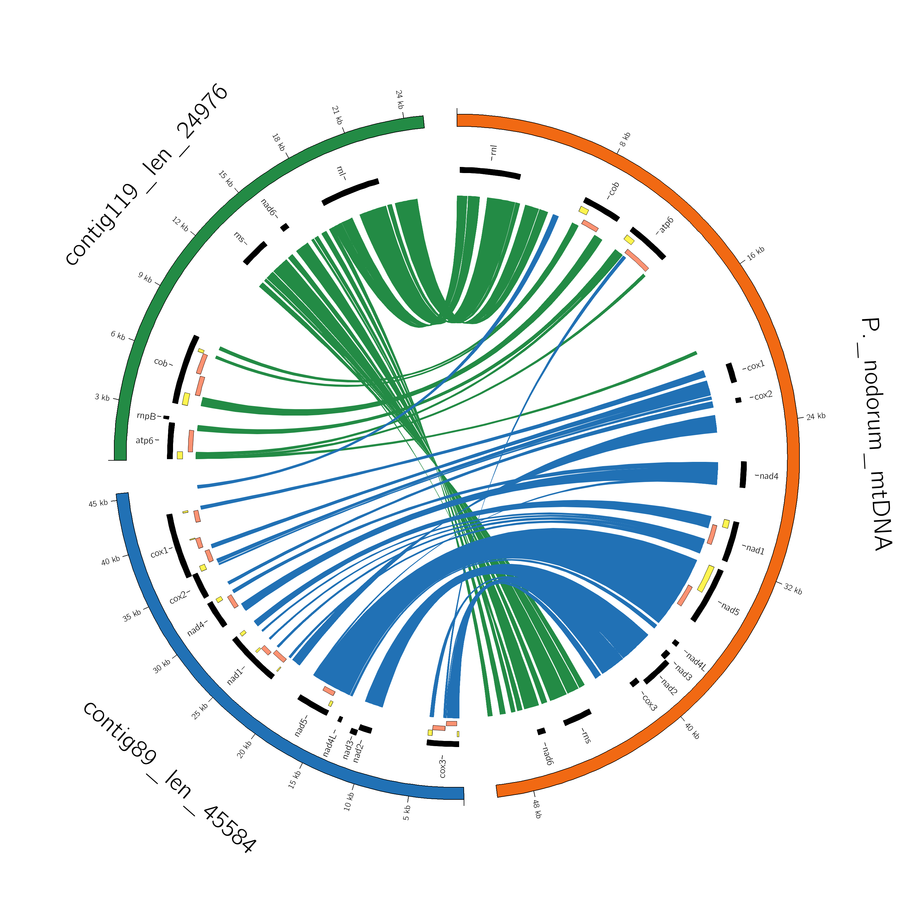

# Circos plot with ribbon links, mtDNA Ophiosphaerella-P.nodorum

Check the [notebook](circos_ribbon.ipynb) for description.

<<<<<<< HEAD

=======
>>>>>>> 079dcf11ac2e347323ac86884ae782bca330abd0
